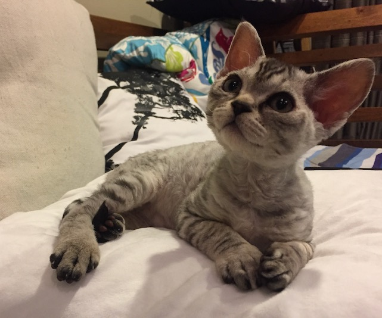

### ZL4CAT

I log via QRZ, LoTW, eQSL. No direct, sorry.

Contact info is qrz@ this domain.

I tend to be around on FT8 (mostly 20/40) & SSTV - other current projects are with APRS and I'm on ZL DMR/National Repeaters as well.

I run with both a IC-7300 and a G90, into an EFHW or a one of my portable verticals. Once various things are opened up here in ZL I hope to be able to do some SOTA/POTA as well.

---

Why ZL4CAT? Well this is my Tamar when she was a few months old, she's a Devon Rex and joined our assorted fur family around 2016 - I'm very much "crazy cat man" according to those familar with me, hence ZL4CAT :)

